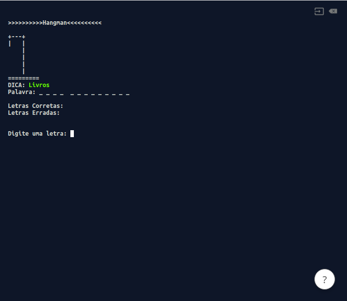
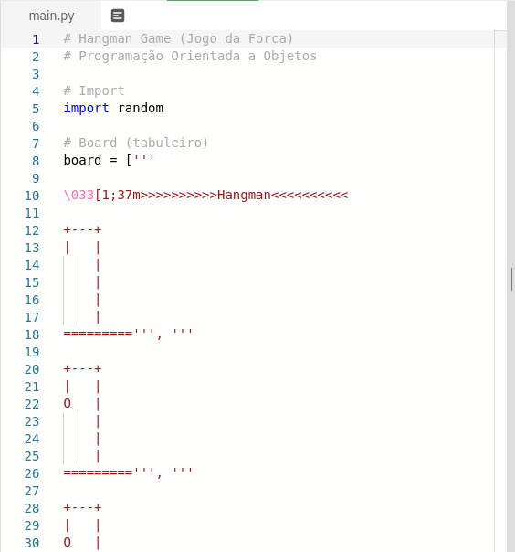

# Hangman Game

## Jogo da Forca em Python.

### Projeto proposto no Curso *Python Fundamentos para Análise de Dados*
### Link do curso: [Data Science Academy](https://www.datascienceacademy.com.br/course?courseid=python-fundamentos)

#### Para testar o jogo ou editar o código acesse: [Hangman Game](https://repl.it/@phdfreitas/hangman)

##### 1. Clique em "run" para testar o jogo:

##### 2. Espere o arquivo ser executado:

##### 3. Faça alterações no arquivo:
